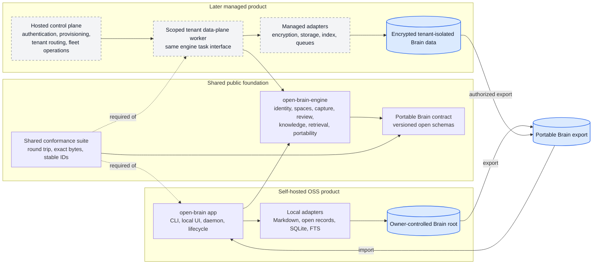
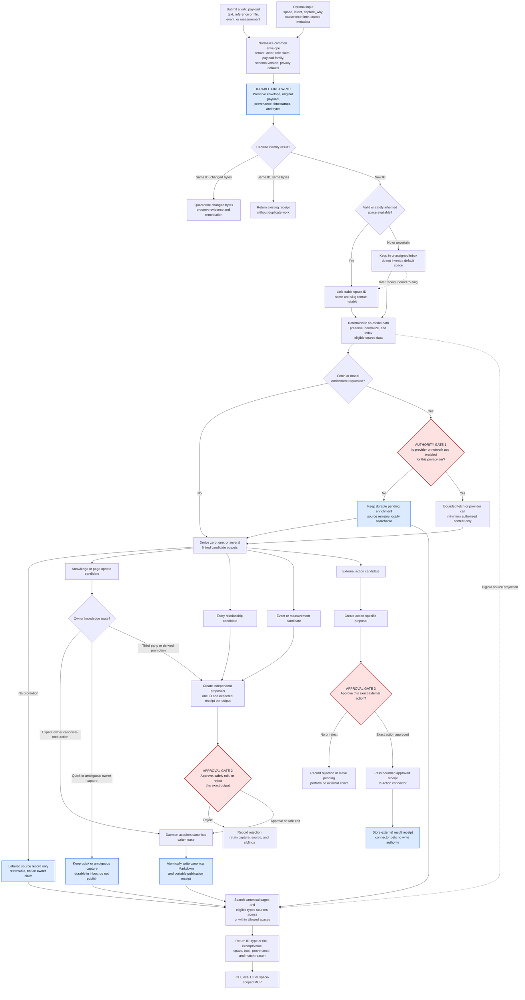
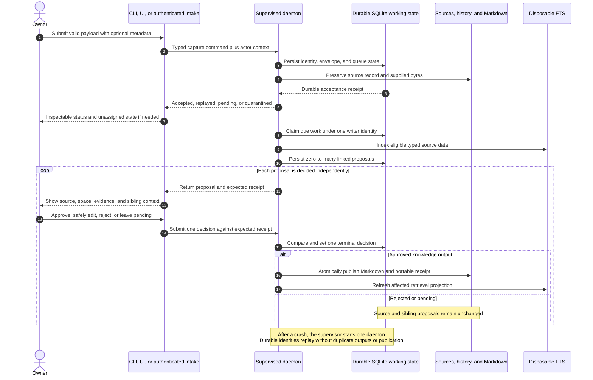
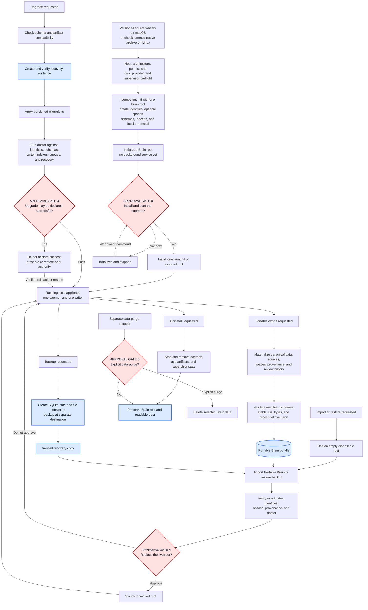
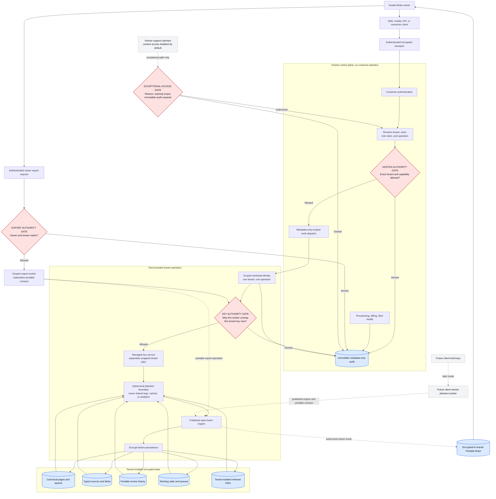
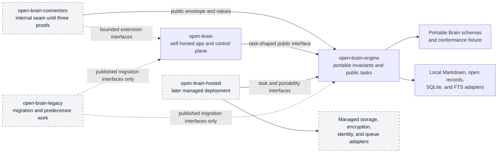

# Open Brain product-family architecture

- Status: Approved target architecture; implementation evidence pending
- Scope: self-hosted OSS v0 plus the compatibility boundary for later managed hosting
- Product contract: [`../v0-product-contract.md`](../v0-product-contract.md)
- Architecture plan: [`../plans/option-c-architecture.md`](../plans/option-c-architecture.md)
- Readiness audit: [`../audits/2026-08-30-oss-readiness-gap-audit.md`](../audits/2026-08-30-oss-readiness-gap-audit.md)

This document shows the approved target architecture. It is not a diagram of the repository as it works today. The current code contains many engine primitives, but generic typed capture, user-created spaces, portable identities, multi-output review, the one-root profile, provider `none`, one daemon, complete local UI, export/import, and release packaging still need to be assembled.

The self-hosted OSS alpha remains the first release. The hosted diagrams define the seams that prevent a later managed service from forking the engine or trapping customer data. They do not add billing, shared teams, or a hosted control plane to the v0 implementation scope.

## The architecture in one sentence

One portable engine durably accepts several kinds of human and system input, organizes them with user-created spaces, derives independently reviewable outputs, and runs either inside one self-hosted appliance or inside an isolated encrypted hosted data plane.

## Diagram legend

- Solid arrow: normal data or control flow.
- Dashed arrow: optional, on-demand, future, or reconciliation flow.
- Blue cylinder: durable Brain-owned data.
- Red diamond: explicit approval or authority gate.
- Gray dashed node: optional or later product component.

## 1. Product-family architecture



The engine and Portable Brain contract are shared. Live storage adapters may differ, but stable identities, spaces, captures, source records, canonical pages, provenance, and review history cannot.

The hosted control plane owns service concerns such as customer authentication, tenant provisioning, billing, and fleet operations. Those records do not enter a Portable Brain and are not required to operate an export locally.

## 2. Self-hosted runtime architecture

```mermaid
flowchart TB
    Owner["Owner"]
    Remote["Remote phone or browser"]
    Tunnel["Authenticated encrypted tunnel"]

    subgraph Surfaces["Owner-controlled surfaces"]
        CLI["Short-lived CLI<br/>capture, spaces, review, search, operations"]
        Browser["Local browser UI<br/>health, inbox, spaces, review, search"]
        Intake["Authenticated HTTP intake<br/>text, reference or file,<br/>event, measurement"]
        Editor["Markdown editor or Obsidian<br/>direct canonical page edits"]
        MCPClient["MCP client"]
    end

    subgraph Host["Always-on Mac or Linux home server"]
        Supervisor["launchd or systemd<br/>one installed service"]

        subgraph App["open-brain application and control plane"]
            Profile["Profile compiler<br/>one root to local tenant, owner,<br/>paths, spaces, and capabilities"]
            Auth["Local authentication,<br/>privacy authority, and egress policy"]
            Tasks["Shared task-shaped application interface"]
            Daemon["One supervised daemon<br/>single canonical writer"]
            Scheduler["Bounded internal scheduler"]
            Portability["Portable export and import orchestration"]
            MCP["On-demand stdio MCP<br/>read-only, space allow-listed"]
            ExtensionHost["Bounded optional connector host"]
        end

        subgraph Engine["open-brain-engine"]
            Identity["Tenant, actor, role claim,<br/>space, and stable record identities"]
            Capture["Typed capture and inbox<br/>durable acceptance, replay, quarantine"]
            Policy["Privacy, provenance,<br/>trust, defaults, and routing policy"]
            Derivation["Zero-to-many linked outputs"]
            Review["Independent proposal review<br/>receipt-bound decisions"]
            Writer["Writer lease and<br/>atomic Markdown publication"]
            Retrieval["Lexical or FTS retrieval<br/>space, type, trust, and explanation"]
            Reconcile["Markdown validation<br/>and index reconciliation"]
            Maintenance["Doctor, backup validation,<br/>restore checks, index rebuild"]
        end

        subgraph BrainRoot["Owner-selected Brain root"]
            Config["brain.toml<br/>public versioned profile"]
            Content[("content/spaces/{space-slug}<br/>canonical readable Markdown")]
            Sources[("sources/records and sources/blobs<br/>typed envelopes and preserved files")]
            History[("history/<br/>portable proposal, decision,<br/>and publication receipts")]
            State[(".open-brain/state<br/>SQLite queues, leases,<br/>and working state")]
            Index[(".open-brain/indexes<br/>disposable FTS projections")]
            Run[(".open-brain/run<br/>metadata-only health and run receipts")]
            Credential[("Owner-only local credential<br/>outside brain.toml")]
        end
    end

    subgraph Optional["Separately installed optional adapters"]
        SourceConnector["Source connector<br/>normalizes to common capture envelope"]
        Provider["Local or cloud provider adapter<br/>privacy-authorized content only"]
        ActionConnector["Action connector<br/>approved action receipt only"]
    end

    Backup[("Separate backup destination")]
    Portable[("Portable Brain bundle")]
    Legacy["open-brain-legacy<br/>migration and predecessor work<br/>excluded from public runtime"]

    Owner --> CLI
    Owner --> Browser
    Owner --> Intake
    Owner --> Editor
    Owner --> MCPClient
    Remote --> Tunnel --> Intake

    Supervisor --> Daemon
    Profile --> Config
    Profile --> Credential
    Profile --> Identity
    CLI --> Tasks
    Browser --> Auth --> Tasks
    Intake --> Auth
    Auth --> Credential
    Daemon --> Tasks
    Scheduler --> Tasks
    Scheduler --> Reconcile
    Tasks --> Identity
    Tasks --> Capture
    Tasks --> Review
    Tasks --> Retrieval
    Tasks --> Maintenance
    Tasks --> Portability
    Daemon --> Writer

    Capture --> Policy --> Derivation --> Review
    Capture --> Sources
    Capture --> State
    Review --> History
    Review --> State
    Review --> Writer
    Writer --> Content
    Writer --> History
    Writer --> State
    Retrieval --> Content
    Retrieval --> Sources
    Retrieval --> Index
    Reconcile -. validates owner edits .-> Content
    Reconcile --> Index
    Maintenance --> State
    Maintenance --> Index
    Maintenance --> Backup
    Portability --> Content
    Portability --> Sources
    Portability --> History
    Portability --> Portable
    Daemon --> Run

    MCPClient --> MCP --> Retrieval
    Editor -. direct edit .-> Content

    SourceConnector -. bounded normalizer .-> ExtensionHost
    ExtensionHost -. typed envelope .-> Capture
    Auth -. provider authority .-> Provider
    Policy -. minimum authorized content .-> Provider
    Provider -. enrichment result .-> Derivation
    Review -. approved action receipt .-> ExtensionHost
    ExtensionHost -. receipt only .-> ActionConnector

    Legacy -. published migration interfaces only .-> Engine

    class Content,Sources,History,State,Index,Run,Credential,Backup,Portable store;
    class SourceConnector,Provider,ActionConnector,Legacy optional;
    classDef store fill:#dbeafe,stroke:#2563eb,color:#111827,stroke-width:1.5px;
    classDef optional fill:#f3f4f6,stroke:#6b7280,color:#111827,stroke-dasharray:5 5;
```



The daemon is the only process that can hold the canonical writer lease. Intake may append to the durable queue, and read surfaces may query a safe view, but neither can publish canonical knowledge directly.

Optional connectors never receive the Brain root, raw database handles, or the writer. They receive the smallest capability needed for one job: normalize and submit a capture, enrich authorized content, or execute one approved action.

## 3. Generic capture, spaces, linked outputs, and retrieval



The first durable write occurs before space routing, fetching, model use, curation, or publication. Space, intent, and reason are optional. Missing values remain unresolved rather than being guessed.

Owner-authored text publishes immediately only through an explicit canonical-note action. Quick capture is still accepted and searchable, but it remains in the inbox until the owner routes or reviews it. Third-party promotion and derived meaning still use proposals.

One capture can produce several outputs. A meeting capture may suggest a page update, a relationship, an event, and an action. Each output has its own proposal and terminal receipt, so approving one does not approve its siblings.

Typed events and measurements remain retrievable source records even if the owner rejects a derived summary. Third-party material can be stored and found without becoming an owner-authored claim.

The same architecture covers very different uses:

| Example input | Normalized payload | Example space | Possible linked outputs |
|---|---|---|---|
| Journal thought or voice transcription | Text | Personal | Page update, idea proposal, relationship |
| Contract, receipt, image, or PDF | Reference or file | Business | Labeled source, entity update, event, action proposal |
| Git commit or deployment webhook | Event | Development | Project activity, decision evidence, follow-up proposal |
| Workout plus heart rate or weight | Event and measurement | Health | Activity record, measurements, trend-summary proposal |
| YouTube or social share | Reference or file | Learning | Labeled source, note proposal, idea proposal |

These space names are examples. Users can rename, replace, or omit them without changing engine behavior.

## 4. Approval and authority gates

| Gate | Kind | Required before | Evidence kept | If absent or denied |
|---|---|---|---|---|
| Install and start daemon | Explicit owner action | Open Brain becomes an always-on supervised service | Installation and supervisor receipt | Brain may be initialized, but no background service is installed |
| Provider or network authority | Owner configuration plus per-content policy | URL fetch, cloud construction, external egress, or restricted model use | Profile, authority decision, bounded provider receipt | Capture stays private and may remain pending enrichment |
| Knowledge or structured-record promotion | Owner decision bound to one proposal | Third-party meaning, relationships, meaningful events, measurements, or edits become canonical owner knowledge | Approval, safe-edit, or rejection receipt | Source remains; this output does not change canonical knowledge |
| External action | Owner decision bound to one action proposal | A connector causes an external side effect | Exact approved action and result receipt | Connector is not called |
| Live restore or upgrade completion | Owner request plus verified system gate | Restored state replaces live state or upgrade is declared successful | Backup, migration, and doctor receipts | Existing authority remains or recovery is required |
| Data purge | Separate destructive owner action | Brain-owned data is deleted | Purge request and bounded result | Uninstall preserves the Brain root |
| Hosted tenant decryption | Automated workload authorization | A hosted worker unwraps one tenant key for one bounded operation | Tenant, worker, capability, operation, and key-use audit | Worker receives no plaintext |
| Exceptional hosted human access | Expiring break-glass authority, if ever implemented | A human can inspect customer content | Reason, authority, scope, duration, and immutable audit | Human access remains disabled |
| Hosted export | Authenticated owner request | The service materializes and releases a Portable Brain | Export request, manifest, conformance result, and delivery receipt | No customer content leaves the tenant boundary |

These operations do not need manual approval each time:

- accepting and preserving a valid capture;
- deterministic extraction and indexing of an eligible source record;
- routing under an owner-authored deterministic rule;
- retrieval through an already authorized surface and space scope;
- deterministic metadata repair that does not change meaning;
- replaying an interrupted idempotent task after restart.

## 5. Portable local data ownership

The hybrid open storage model, version `1` directory names, and JSON/JSONL boundary are approved. Markdown, versioned structured records, content-addressed blobs, and non-canonical SQLite each have a distinct role.

```text
<brain-root>/
  brain.toml                       public profile and layout version; no secrets
  content/
    spaces/
      <space-slug>/
        _space.md                  stable space ID, mutable name, safe defaults
        ...                        canonical readable Markdown
  sources/
    captures/
      YYYY/MM/<capture-id>.json    immutable typed envelope and provenance
    batches/
      YYYY/MM/<batch-id>.jsonl     referenced event or measurement batch
    blobs/
      sha256/<first-two-hex>/<sha256> content-addressed preserved files
  history/
    proposals/YYYY/MM/<proposal-id>.json
    decisions/YYYY/MM/<decision-id>.json
    publications/YYYY/MM/<publication-id>.json
    actions/YYYY/MM/<action-id>.json
  .open-brain/
    state/open-brain.sqlite3       SQLite queues, leases, and working state
    indexes/search.sqlite3         disposable FTS projections
    run/                           metadata-only health and run receipts
    credentials/                   owner-only local credentials; never portable

<separate-backup-destination>/     verified recovery copy, never inside Brain root
```

Every accepted capture has one canonical UTF-8 JSON envelope. High-volume event and measurement imports use immutable JSONL sidecars referenced by that envelope. Portable proposals, decisions, publication receipts, and action receipts remain individual JSON records. Date partitions come from immutable UTC acceptance or recording timestamps so corrected source timestamps never move accepted files. Corrections append a record linked with `supersedes`.

Versioned JSON Schemas and conformance fixtures must freeze deterministic serialization, UTC RFC 3339 timestamps, one canonical record per JSONL line, LF termination, SHA-256 manifest checksums, and Portable Brain round trips before implementation. Those files are specification evidence, not another product decision.

| Data class | Authority | Portable? | Behavior after uninstall |
|---|---|---:|---|
| Canonical Markdown | Owner plus canonical writer rules | Yes | Preserved and readable |
| Space definitions | Owner or receipt-bound routing rules | Yes | Preserved and readable |
| Typed source records and blobs | Capture identity, provenance, and privacy rules | Yes | Preserved and inspectable |
| Portable review history | Proposal, decision, publication, and action receipts | Yes | Preserved and inspectable |
| Operational SQLite | Engine schemas and one writer lease | No direct live copy; export materializes portable state | Preserved by default |
| FTS indexes | Retrieval adapter | No; rebuilt from portable data | Safe to delete or preserve |
| Runtime receipts | Daemon metadata-only policy | Only receipts required by portable history | Preserved or pruned by retention policy |
| Local credential | App lifecycle and owner-only permissions | No | Preserved or rotated by explicit lifecycle policy |

Stable IDs do not depend on directory names. Renaming `Work` to `Studio`, for example, can move or rename a directory while preserving the same space identity and provenance.

Direct edits from Obsidian or another Markdown editor remain supported. Reconciliation validates the versioned page schema, refreshes retrieval for valid edits, and records remediation for invalid files. It never silently overwrites the owner's edit.

## 6. Runtime, restart, and independent review behavior



The operating system supervises one service, not one job per task. Slow optional connectors run with bounded time and concurrency so they cannot block capture publication or review.

## 7. Install, export, recovery, upgrade, and removal



Export and backup solve different problems. Export is the documented cross-deployment data contract. Backup preserves a recoverable instance, including local operational details where appropriate.

Restore and import never write over the only live copy. Uninstall and data deletion remain separate operations.

## 8. Managed hosting and envelope-encryption flow



Envelope encryption means each tenant has a separate data-encryption key, wrapped by a managed key boundary. A worker must have both application authorization and key-use authorization. Tenant identity alone is not a decryption grant.

Human support does not have ordinary content access. A future exceptional-access path, if the product ever enables one, must be explicit, expiring, narrow, and fully audited.

Client-held encryption is preserved as an architecture path, not promised for the first hosted release. It would move plaintext-dependent search, enrichment, and connector work to a client-owned worker or separately evaluated trusted-compute environment.

## 9. Capability and trust boundaries

| Surface or component | Capabilities it receives | Capabilities it does not receive |
|---|---|---|
| Self-hosted CLI | Task-shaped capture, spaces, inbox, review, search, portability, maintenance, and lifecycle operations | Raw stores or provider construction |
| Local UI | Authenticated health, unassigned inbox, spaces, proposal review, search, and page views | Direct filesystem or database access |
| HTTP intake | Submit a valid common payload plus optional metadata | Review, publication, administration, or action authority |
| stdio MCP | Bounded retrieval for explicitly allowed spaces and metadata feedback | Capture, review, publication, administration, unlisted spaces, or writer authority |
| Source connector | Approved transport, checkpoint store, typed capture sink, clock, and metadata-only logger | Brain root, canonical writer, raw store, or action authority |
| Provider adapter | Minimum privacy-authorized input through the provider port | Capture, publication, review, connector, or filesystem authority |
| Action connector | One exact approved action receipt plus bounded transport | Capture authority, general owner credentials, Brain root, or canonical writer |
| Hosted control plane | Tenant metadata, role claims, routing, fleet state, and metadata-safe audit | Customer plaintext or tenant decryption keys |
| Hosted data-plane worker | One tenant, one operation, one scoped key-use request, and engine capabilities | Cross-tenant queries, durable plaintext, billing data, or human support authority |
| Markdown editor | Owner-controlled canonical file edits | Operational state or writer lease |

Loopback HTTP still requires authentication. Self-hosted remote access goes through an authenticated encrypted tunnel. Direct non-loopback binding is an advanced opt-in that must pass a security preflight.

Captured text, structured values, filenames, fetched content, and model output are untrusted when rendered. Secrets stay outside public configuration, canonical Markdown, Portable Brain exports, result envelopes, logs, and URLs.

## 10. Connector maturity path

The connector interface stays internal until three source patterns prove it:

| Stage | Representative connector | Architectural proof |
|---|---|---|
| 1 | YouTube polling connector | Remote fetch, cursor checkpoints, duplicate delivery, bounded preserved content |
| 2 | GitHub event connector | Occurrence time, ordering, updates, webhook or OAuth authority, replay |
| 3 | CSV measurement importer | Units, dimensions, batches, corrections, deterministic replay, and volume limits |
| 4 | Cross-connector reconciliation | Extract only behavior shared by all three; remove source-specific assumptions |
| 5 | Public Connector SDK | Versioned API, capability manifest, conformance suite, isolated workers, package signing, compatibility policy |

The first reference connector may exercise the internal seam during OSS work, but none of the three source-specific connectors blocks the self-hosted v0 release. Capture and action authority remain separate after the SDK is published.

## 11. Package and release boundaries



The forbidden directions are:

- engine to app, connectors, hosted, or legacy;
- app to connector implementations, hosted, or legacy;
- hosted to app internals, local app stores, or legacy;
- connectors to app internals or local stores;
- any public runtime package to legacy.

The repository remains a monorepo while the generic no-model slice is proven. Physical package movement comes later. The managed deployment remains a downstream consumer and starts only after the OSS Portable Brain boundary is published.

## 12. Default self-hosted v0 behavior

| Concern | Default |
|---|---|
| Owner and isolation | One generated local tenant and one owner actor |
| Writer topology | One local canonical writer |
| Installation | Versioned source checkout or app/engine wheels on macOS 14+ `arm64`; PyInstaller one-folder archive on Linux `x86_64`; native macOS DMG deferred |
| Configuration | One Brain root and the `single-user-local` profile |
| Organization | User-created spaces, optional templates, and an unassigned inbox |
| Built-in payloads | Text, reference or bounded file, event, and measurement |
| Intake metadata | Space, intent, and reason optional; safe defaults inherited |
| Owner-authored text | Explicit canonical-note action publishes immediately; quick or ambiguous capture remains in inbox |
| Canonical data | Readable Markdown plus versioned open source and history records |
| Operational state | Local SQLite beneath the Brain root |
| Retrieval | Lexical or FTS across allowed spaces and typed sources |
| Provider | `none`; local provider optional; cloud disabled |
| Network | Loopback HTTP and on-demand space-scoped stdio MCP |
| Optional connectors | Separately installed and capability-bounded |
| Background work | One supervised daemon with internal schedules |
| Export | Portable Brain contract; credentials and indexes excluded |
| Uninstall | Preserve the Brain root |

Provider mode `none` is a complete operating mode. It supports durable typed capture, source preservation, spaces, proposal and publication rules, lexical retrieval, and visible pending enrichment without a model or cloud account.

## 13. What exists now and what this proposal adds

| Already present in the codebase | Still required for this target |
|---|---|
| Capture identity, provenance, privacy policy, durable queues, review receipts, atomic Markdown writes, SQLite safety, writer locks, backup primitives, bounded HTTP, and read-only MCP | Common typed envelopes, tenant/actor/role identities, user-created spaces, unassigned routing, sibling proposals, portable source/history schemas, export/import conformance, one-root provider-none composition, shared CLI/UI tasks, one daemon, lifecycle controls, macOS source/wheel and Linux native release paths, hosted-safe ports, and enforced package boundaries |

The current production path can publish owner text under `work_root/inbox/open-brain/` while the active retriever scans `work_root/pages/`. That mismatch remains the immediate warning: prove a black-box capture-to-retrieval journey before moving packages or building hosting.

## Approved decisions incorporated here

1. Hosted and self-hosted use the same engine and Portable Brain contract.
2. Hosted launch means isolated single-owner Brains with tenant, actor, and role identities from the start.
3. User-created spaces replace hard-coded personal, business, development, or activity domains.
4. One pipeline accepts text, reference or file, event, and measurement payloads.
5. One immutable capture may produce independently reviewable linked outputs.
6. Hosted data uses per-tenant envelope encryption, scoped decryption workers, disabled human access by default, immutable exceptional-access audit, and a path to client-held encryption.
7. Capture accepts immediately with safe inherited defaults; space, intent, and reason are optional.
8. Reference, event, and measurement connectors prove an internal interface before a public SDK freezes the capability manifest, conformance, isolation, signing, and compatibility contract.
9. GitHub is the selected event connector proof.
10. CSV import is the selected measurement connector proof.
11. YouTube polling is the selected reference connector proof.
12. Owner-authored text publishes immediately only through an explicit canonical-note action; quick or ambiguous capture remains in the inbox.
13. Open Brain uses a hybrid open format: Markdown for canonical human knowledge, structured records for typed and historical data, content-addressed blobs for preserved files, and SQLite only for operational state and disposable indexes.
14. Brain-root layout version `1` uses the readable, date-partitioned paths shown above, with operational state isolated under `.open-brain/`.
15. Individual captures and portable history use canonical JSON. Referenced JSONL sidecars handle high-volume event and measurement batches. Versioned schemas and conformance fixtures are mandatory.
16. v0 supports source/wheel installation on macOS 14 or newer on Apple Silicon and a native archive on Linux `x86_64` on Ubuntu 24.04 LTS, Ubuntu 26.04 LTS, and Debian 13. Intel macOS, Linux `arm64`, and Windows are deferred.
17. PyInstaller 6 one-folder mode is the Linux bundler candidate, with Nuitka standalone as its accepted fallback. A signed and notarized macOS DMG is deferred to a later release.

## Approved boundaries awaiting evidence

No further owner choice remains for storage layout, serialization policy, supported hosts, or the bundler path. Two implementation artifacts remain:

1. Reviewable versioned JSON Schemas plus canonical JSON, JSONL batch, checksum, correction, and Portable Brain round-trip fixtures.
2. macOS 14 ARM64 source and isolated-wheel installation evidence, plus Linux PyInstaller
   clean-host evidence or recorded failure evidence followed by the accepted Nuitka spike.

The hosted implementation stack can be selected later. That decision should not change the common envelope, engine, spaces, Portable Brain contract, connector authority separation, or approval boundaries.
