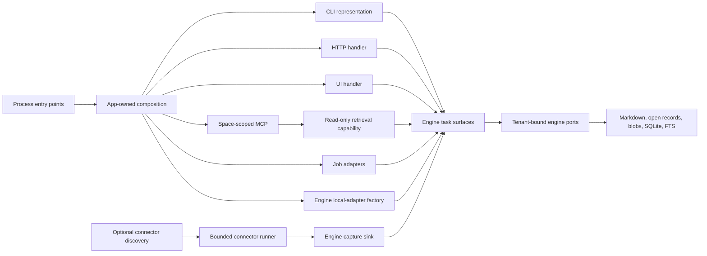

# Phase 2 implementation plan: deepen modules in place

- Status: Phase 2 boundary implemented in place; W5 verification is the exit gate
- Baseline: `4ea51d9be7853b0f33068b2af1b641b5fbedab3e` W4 checkpoint
- Planning branch: `phase2-planning`
- Estimate: 8 to 12 working days for one maintainer
- Product authority: [`../v0-product-contract.md`](../v0-product-contract.md)
- Architecture authority: [`option-c-architecture.md`](option-c-architecture.md), Phase 2
- Phase 1 evidence: [`../ai/workstreams/20260830-open-brain-public-implement-and-verify-the-approved-phase-1-in-place-vertical-slice-through-v0-gat-bcf03d/PHASE-1-IMPLEMENTATION.md`](../ai/workstreams/20260830-open-brain-public-implement-and-verify-the-approved-phase-1-in-place-vertical-slice-through-v0-gat-bcf03d/PHASE-1-IMPLEMENTATION.md)
- Plan review: verified five-lens `doc-review`; six actionable findings fixed; no failed lenses

## Objective

Deepen the current monolith until the portable engine, application composition, optional connector boundary, and legacy boundary have enforceable ownership. Keep the package tree in place. Make every product surface call the same engine task interfaces. Add a real Portable Brain export/import path and one optional YouTube reference-connector proof without starting the Phase 3 appliance control plane or the Phase 4 distribution split.

Phase 2 is complete only when all eight import rules pass, the default profile works with no connector installed, and the pure-engine test subset runs in a fresh subprocess without loading CLI, HTTP/UI/MCP representations, app composition, connectors, OS supervisors, legacy modules, or workspace tooling. A populated local root must round-trip through the engine portability interface with exact bytes and stable identities, and public result envelopes must contain no absolute paths, secrets, raw private source references, or reversible digests of those references.

## Authority and sequencing decisions

The following decisions close the two ambiguities recorded by Phase 1. They refine implementation sequencing and do not change the approved product contract.

1. **Phase 2 splits ownership inside `src/open_brain`.** Files and symbols may move into single-owner internal modules. Phase 2 does not create the four distributions, move code under `packages/`, remove compatibility paths needed by the current tree, or claim isolated artifact evidence. Those are Phase 4 tasks.
2. **The PyInstaller/Nuitka spike moves to Phase 4.** The accepted bundler order does not change. The spike needs the Phase 3 daemon, lifecycle, backup, restore, upgrade, and uninstall surfaces before it can produce meaningful evidence.
3. **Phase 2 proves connector absence at the discovery boundary.** The default application must behave correctly when discovery returns no installed connectors. Phase 4 repeats the test with the connector distribution physically absent.
4. **Portable import targets a new root only.** Merge import is outside v0. Import validates and stages an export before atomically creating a clean compatible root. A conflicting or non-empty target fails closed.
5. **The portable root becomes self-describing for non-secret identity.** `brain.toml` must carry the stable tenant, owner actor, owner role, and current owner role-claim identifiers needed to reopen an imported Brain. Credentials remain operational and excluded. Deriving the owner from arbitrary history is ambiguous, and exporting `.open-brain/identity.json` would violate the portability boundary.

## Scope boundary

| In Phase 2 | Deferred |
|---|---|
| Internal module extraction and file-level ownership | Four separate distributions and `packages/` layout, Phase 4 |
| Eight enforceable import rules | Isolated wheel/native artifact builds, Phase 4 |
| Shared engine task contracts for CLI, HTTP, UI, MCP, and job adapters | Daemon lifecycle, internal scheduler ownership, launchd/systemd, Phase 3 |
| Engine-level Portable Brain materialization, validation, clean-root import, and index rebuild contract | Public backup/restore/upgrade/uninstall orchestration, Phase 3 |
| Internal connector discovery/run contract and YouTube reference proof | Public Connector SDK, signing, isolated workers, GitHub/CSV proofs |
| Tenant-bound storage and content-protection ports with a local implementation | Hosted control plane, managed KMS, client-held encryption |
| Metadata-safe public task results | Graph, vector, multi-agent, broad integrations, legacy cutover |

## Current baseline

| Area | Current Phase 2 state | Boundary that remains deferred |
|---|---|---|
| Engine | `open_local_engine()` exposes one task set for profile, capture, inbox/spaces, review, retrieval, and Portable operations | Phase 3 backup/restore, upgrade, uninstall, and appliance lifecycle |
| Composition | `SingleUserLocalApplication` opens one root and supplies bounded capabilities to six CLI families, HTTP/share, UI, MCP, and public-job sinks | Phase 3 one supervised daemon and internal scheduler |
| Dependency graph | Runtime ownership is file-classified; default shipping paths retain the monolith while excluding predecessor-only legacy paths | Phase 4 physical distributions and `packages/` layout |
| Portable Brain | Engine tasks validate, export, clean-import, and rebuild the disposable index with exact-byte snapshot binding and operational exclusion | Phase 3 public backup/restore orchestration |
| Connectors | The default profile is connector-empty; explicit `JOB-029` uses the internal allow-listed host, capture-only identity, host evidence, and receipt-bound checkpoint | Phase 4 public Connector SDK, signing, isolated workers, and additional connector proofs |
| Public results | Engine projection returns opaque IDs, bounded provenance, and useful text without raw source references, absolute paths, credentials, or reversible source-reference digests | Graph, vector, multi-agent, broad integrations, and legacy cutover |

## Target in-place architecture



The engine public surface remains task-shaped. It must not become a generic command bus or expose raw SQLite, Markdown writer, filesystem, provider, or transport objects.

## Required contracts

### Engine tasks and values

Keep the existing Capture, Inbox/Spaces, Review, and Retrieval tasks. Add:

- `CaptureSubmission`, a normalized request carrying payload, delivery identity, source origin/reference, provenance, privacy, actor/role context, optional space/intent/reason, and occurrence time. Owner surfaces and connectors use the same value.
- `PortabilityTasks`, with validate, export, and clean-root import operations returning bounded receipts.
- a metadata-safe retrieval result whose provenance contains opaque capture/source-record IDs and bounded source-origin labels. It returns neither a raw private source reference nor a bare digest that can be reversed with a candidate dictionary.
- a read-only retrieval capability whose search and fetch operations both enforce the caller's explicit space allow-list. MCP receives this capability, not the unrestricted retrieval task.
- narrow maintenance capabilities needed to rebuild the disposable index after import. Backup, upgrade, and uninstall orchestration remain Phase 3.

Move task values and results out of `engine/local.py` into engine-owned contract modules. Keep local SQLite/filesystem construction behind a public engine-local factory so the app imports `open_brain.engine`, not `open_brain.engine.local`.

### Canonical lock vocabulary

Move `LockScope` to a pure engine-owned module such as `core/locks.py`. Storage and local engine adapters import that value from core. Application operations import it through the engine public surface. Do not make app code import the storage adapter merely to share an enum, and do not preserve a second operations-owned copy.

### Portable storage and identity

Add narrow engine ports for source records, immutable batches, blobs, portable history, tenant-bound storage, and content protection. The local factory supplies root-confined plaintext filesystem implementations. The content-protection interface must not claim local plaintext is encrypted.

Extend the versioned `brain.toml` profile with non-secret identity fields and strict standard-library validation. Runtime conformance continues to use typed validation plus exact canonical-byte checks; `jsonschema` remains a test dependency. The live root does not treat `portable-manifest.json` as current state. Export creates a manifest in a new destination. Import validates the source manifest, copies its listed files, and records operational import/rebuild evidence separately.

### App composition

Use `services/phase1_application.py` as the final Phase 2 app-owned composition root. It compiles
`single-user-local`, opens the public engine-local factory, and supplies bounded capabilities to
process entry points. `services/composition.py` remains transport/service composition.
`services/phase1_entrypoints.py` owns the installed CLI, HTTP, and MCP startup. The
`open-brain` and `python -m open_brain` entry points call this app boundary directly.
`services/application.py` and `services/entrypoints.py` retain predecessor and scheduled
compatibility under legacy ownership.

`cli` contains parsing and representation only. `production` and `operations` return owner-module records rather than CLI exit/result types. CLI converts those records at the edge.

### Internal connector seam

The app owns the internal extension interface. It includes:

- a manifest declaring connector version, payload families, egress, secrets, schedules, and action authority;
- discovery through one entry-point group filtered by an explicit per-profile connector-name allow-list; the default allow-list is empty;
- a bounded run context containing an approved transport, checkpoint store, capture sink, clock, budget, and metadata-only logger;
- a metadata-only run receipt with completed, empty, deferred, and failed outcomes;
- fail-closed checks for malformed manifests, missing capability authority, duplicate registration, and unbounded output.

The YouTube proof adapts the existing polling behavior to this interface with injected synthetic transport. It preserves third-party provenance, cursor checkpoints, duplicate delivery, bounded fetch, and source material. Its run context carries a connector actor and bounded connector role claim; the runner rejects an owner actor or owner-only capability. It has no action authority and is not registered by the default profile.

## Import rules

Extend `docs/v0-package-classification.json` with file-level ownership for every module under the currently mixed package containers. A top-level container may remain mixed until Phase 4, but no runtime file may remain unclassified or have mixed ownership at Phase 2 exit.

| ID | Enforced rule |
|---|---|
| `engine-to-app` | Engine files cannot import app, connector, hosted, legacy, or workspace files. |
| `app-to-engine-internals` | App files import only the engine public surface, not local stores or engine internals. |
| `connector-capability-only` | Connector files import only the internal extension contract and public engine values. |
| `shipping-to-legacy` | No default shipping path imports migrate, parity, cutover, shadow, or predecessor-only code. |
| `hosted-to-local-internals` | Synthetic hosted fixtures may import only public engine and Portable Brain surfaces. |
| `representation-to-adapters` | CLI, HTTP, UI, and MCP representations cannot import stores, writers, providers, transports, or composition. |
| `adapter-to-adapter` | External adapter implementations cannot import one another. |
| `runtime-to-workspace` | Runtime code cannot import `dev`, tests, or workspace tooling. |

The AST rule implementation must include a failing synthetic fixture for every rule. Adapter-to-adapter enforcement is symmetric, so every connector owner is checked as both source and target. Literal `importlib.import_module()` and `__import__()` calls targeting `open_brain.*` are checked against the same owner rules. Non-literal entry-point loading is permitted only at the app-owned extension host, which filters a named allow-list before loading and validates the returned manifest and capabilities. A rule is not considered enforced because its corresponding namespace does not exist yet.

## Execution waves

Each wave starts from the previous clean checkpoint. Run its focused check, Ruff, and MyPy for changed Python surfaces, then run `make verify`. Commit locally only after both checks pass. Do not push during Phase 2 implementation unless separately authorized.

### P2-W0: freeze boundaries and canonical vocabulary

Estimate: 1 day.

Work:

- correct the Phase 2/4 wording and bind the bundler spike to Phase 4;
- add file-level ownership and all eight machine-readable import rules;
- add synthetic negative tests for every static and literal dynamic-import rule and record current live violations as named Phase 2 debt;
- move the single `LockScope` definition to `core/locks.py` and update all users;
- freeze current task-facade and cross-surface behavior before composition moves.

Focused check:

```bash
uv run pytest -q tests/security/test_architecture_imports.py tests/security/test_architecture_boundaries.py tests/unit/storage/test_locks.py tests/integration/services/test_phase1_surfaces.py
uv run ruff check src/open_brain/core src/open_brain/storage src/open_brain/operations tests/security tests/unit/storage
uv run mypy
```

Exit gate: one lock vocabulary exists, so no `storage -> operations` edge remains; every current source file has a target owner; every rule has a synthetic failure test; and the live-debt list exactly names all remaining violations.

### P2-W1: invert application composition

Estimate: 2 days.

Work:

- create the app-owned `services/application.py` composition root;
- move process startup to `services/entrypoints.py` and make CLI entry modules representation-only;
- fold or replace `production.application` so production code no longer imports CLI;
- replace `operations -> cli` result dependencies with operations-owned records;
- replace `config -> ledger` types with app-owned configuration values converted at composition;
- remove predecessor-only migrate/parity/cutover routes from default app composition while retaining their modules under a legacy file classification until Phase 4;
- make profile compilation import only the engine public factory and values;
- activate the live import rules closed by this wave.

Focused check:

```bash
uv run pytest -q tests/security/test_architecture_imports.py tests/integration/cli/test_composition.py tests/integration/cli/test_production_adapters.py tests/integration/services/test_entrypoints.py tests/integration/services/test_service_composition.py tests/integration/operations/test_production_bindings.py
uv run ruff check src/open_brain/cli src/open_brain/services src/open_brain/production src/open_brain/operations src/open_brain/config.py
uv run mypy
```

Exit gate: no `production -> cli`, `operations -> cli`, or `config -> ledger` edge remains; supported default entry-point behavior and exit classes are unchanged, and removed predecessor-only routes are recorded as pre-alpha compatibility changes.

### P2-W2: converge surfaces on engine tasks

Estimate: 2 days.

Work:

- extract engine task inputs/results and local helpers from the prior local-engine monolith without changing durable behavior;
- add `CaptureSubmission` and make owner and connector-originated capture share one normalization path;
- route CLI, authenticated HTTP, local UI, read-only MCP, and public job adapters through one `SingleUserLocalApplication` task set;
- make HTTP accept all four payload families without bypassing engine durability or review policy;
- give MCP only retrieval plus its explicit space allow-list and metadata feedback capability;
- replace raw source references and bare source-reference digests in engine results with opaque record IDs and bounded source-origin labels;
- make both retrieval search and fetch enforce an injected space allow-list before exposing the capability to MCP;
- keep the cross-process and cross-surface journey in `tests/integration/services/test_phase1_surfaces.py`; `tests/integration/engine` contains only pure-engine integration tests at Phase 2 exit;
- classify retrieval/context as engine, UI/MCP as app, connector runtimes as connectors, and cutover/shadow as legacy without creating distributions.

Focused check:

```bash
uv run pytest -q tests/integration/engine tests/integration/capture/test_share_http.py tests/integration/mcp/test_mcp.py tests/integration/services tests/security/test_architecture_boundaries.py tests/security/test_architecture_imports.py
uv run ruff check src/open_brain/engine src/open_brain/capture src/open_brain/integrations src/open_brain/services tests/integration/engine tests/integration/capture tests/integration/mcp tests/integration/services
uv run mypy
```

Add `tests/integration/services/test_phase2_surfaces.py` to prove the five product representations use the same underlying engine task objects and observe the same stable IDs.
Add an MCP regression that fetches a known result ID from outside the caller's allow-list and receives the same bounded denial as an unknown result.

Exit gate: all surfaces use engine tasks, no representation imports a concrete adapter, HTTP supports the common capture families, and MCP search and fetch remain read-only and space-scoped. No surface returns a raw source reference or its bare digest.

### P2-W3: implement Portable Brain engine interfaces

Estimate: 2 to 3 days.

Work:

- add strict portable profile identity to `brain.toml` and migrate the Phase 1 profile without changing stable IDs;
- add source-record, batch, blob, history, tenant-storage, and content-protection ports with root-confined local implementations;
- validate capture, proposal, decision, publication, action, space, and page records before portable persistence;
- add `PortabilityTasks` to materialize a live-root export into a new destination;
- add clean-root import using same-filesystem staging and atomic promotion;
- restore stable tenant/owner/role identity from the portable profile, initialize operational state, and rebuild the disposable search index;
- make interrupted export/import retryable without exposing a partial authoritative root.

Focused check:

```bash
uv run pytest -q tests/contract/test_portable_brain_v1.py tests/unit/engine/test_profile.py tests/integration/engine/test_vertical_slice.py tests/integration/engine/test_portability.py
uv run ruff check src/open_brain/portable src/open_brain/profile.py src/open_brain/engine tests/contract tests/unit/engine tests/integration/engine
uv run mypy
```

`tests/integration/engine/test_portability.py` must cover exact canonical/source/history/blob bytes, stable IDs, review outcomes, space membership, index rebuild, credential exclusion, conflict rejection, symlink/traversal rejection, and faults before and after atomic promotion.

Exit gate: a populated local root exports and imports through the engine interface; the imported engine reopens with the same portable identities and results; no `.open-brain` credential, database, lease, runtime, or index file enters the export.

### P2-W4: prove the optional reference connector seam

Estimate: 2 days.

Work:

- add internal connector manifest, discovery, registry, run context, capture sink, checkpoint, and run receipt contracts;
- fail closed on malformed or duplicate registrations, discovered connector names absent from the profile allow-list, and unsupported capability requests;
- adapt YouTube polling to the engine capture sink with injected transport and checkpoints;
- preserve third-party source/provenance and use delivery IDs for replay;
- prove egress-disabled execution performs zero transport and credential work;
- keep connector discovery empty in `single-user-local` unless explicitly configured.

Focused check:

```bash
uv run pytest -q tests/integration/services/test_connectors.py tests/integration/connectors/test_youtube_reference.py tests/integration/capture/test_youtube_poll.py tests/integration/production/test_youtube_poll_runtime.py tests/integration/engine/test_vertical_slice.py tests/security/test_architecture_imports.py
uv run ruff check src/open_brain/services src/open_brain/capture src/open_brain/production tests/integration/services tests/integration/connectors
uv run mypy
```

Exit gate: the synthetic YouTube proof passes checkpoint, duplicate, bounded-fetch, restart, provenance, and no-action-authority tests; the complete provider-none default journey passes with no connector discovered.

### P2-W5: reconcile the complete Phase 2 boundary

Estimate: 1 day.

Work:

- remove every temporary architecture debt entry and reject any unclassified or mixed-owner runtime file;
- add an isolated engine import test that runs in its own fresh subprocess and fails if CLI, HTTP/UI/MCP representations, app composition, connectors, OS supervisors, legacy modules, or workspace tooling load;
- scan JSON, text, and HTML task results for absolute paths, credential markers, raw synthetic private values, and the bare SHA-256 digests of those values;
- rerun the Phase 1 journey to prove no behavior regression;
- update `README.md`, `CLAUDE.md`, architecture, portability, configuration, CLI, and privacy docs to describe the Phase 2 boundary accurately;
- run an independent architecture/privacy review and require `READY`.

Focused and full checks:

```bash
uv run pytest -q tests/security/test_engine_isolation.py
uv run pytest -q tests/security/test_architecture_imports.py tests/security/test_public_result_residue.py tests/contract/test_portable_brain_v1.py tests/integration/engine tests/integration/services tests/integration/connectors
uv run ruff check .
uv run mypy
make verify
git diff --check
PRIVATE_DENYLIST=<untracked-owner-denylist> make audit
```

Before the audit, create an untracked denylist containing only a comment that records the owner's approved choice of no additional project terms.

Exit gate: every Phase 2 requirement and import rule has direct passing evidence on one clean commit, the worktree is clean, and the review verdict is `READY`.

## Traceability

| Contract area | Primary wave | Required evidence |
|---|---|---|
| `FOUNDATION-IDENTITY-*`, `FOUNDATION-SPACE-*` | W2, W3 | Stable IDs and role claims through capture, rename, export, and import |
| `FOUNDATION-PORTABLE-01` through `04` | W3 | Same schemas, exact bytes, clean-root import, credential exclusion |
| `V0-CAPTURE-01` through `10` | W2, W4 | Four-family surfaces, connector normalization, no-model and duplicate behavior |
| `V0-REVIEW-*` | W2, W3 | Shared task interface and preserved sibling decisions/history |
| `V0-DATA-01` through `06` | W2, W3 | Versioned records, blobs, validation, rebuildable index, portable import/export |
| `V0-QUERY-01` through `06` | W2, W5 | Lexical results, space scope, trust/provenance, read-only MCP |
| `V0-SURFACE-01` through `07` | W1, W2 | One app task set with bounded CLI/HTTP/UI/MCP representations |
| `V0-PRIVACY-01` through `08` | Every wave | No-egress defaults, late capability construction, residue-free public results |
| Phase 2 Option C exit gates | W5 | Eight rules, connector absence, engine isolation, round trip, output safety |

## Stop and rollback rules

Stop the current wave if it requires a physical distribution split, a public Connector SDK, live connector credentials/network evidence, hosted control-plane behavior, daemon/supervisor lifecycle, predecessor parity, or a change to a product-contract MUST. Return to product review instead of expanding the wave.

Do not advance after a failed focused or full check. Preserve the last clean checkpoint. Revert only the incomplete wave after inspecting its failure; never weaken Portable v1 fixtures, privacy gates, writer rules, or architecture tests to obtain a pass.

## Phase 2 definition of done

Phase 2 is done when:

- the live source graph satisfies all eight import rules with no temporary debt entries;
- CLI, HTTP, UI, MCP, and public jobs receive only the public task capabilities they need;
- the pure-engine test subset runs in a fresh subprocess without loading CLI, HTTP/UI/MCP representations, app composition, connectors, OS supervisors, legacy modules, or workspace tooling;
- a populated root round-trips through local engine export/import with stable identities and exact portable bytes;
- the YouTube reference connector proves the internal seam while the default profile remains complete with no connector installed;
- public results are bounded and contain no absolute path, credential, raw private source reference, or reversible bare digest of such a reference;
- `make verify`, the release audit, `git diff --check`, and independent final review pass on the same clean commit.
